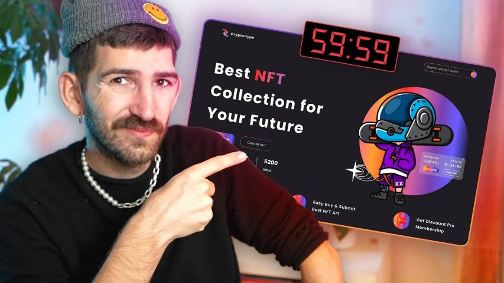

# Challenge « 1h pour coder une page d'ecommerce NFT »

## Contexte

[Challenge : 1h pour coder une page d'ecommerce NFT ???](https://www.youtube.com/watch?v=kgJrwkd_KlA)

## Les assets
- [La maquette d'Ali Husni](https://dribbble.com/shots/16950858-NFT-Marketplace-Landing-Page-Animation?showSimilarShots=true&_=1638112485538)
- [Illustrations de noël](https://wannathis.one/freebies/free-christmas-3d-illustrations) par [@Wannathis](https://wannathis.one)

## Config de départ
- Mes mixins Sass
- [Bootstrap reboot](https://getbootstrap.com/docs/4.0/content/reboot/)
- [Mon Prepros d'amour 💗 pour avoir un live server multidevice et compiler mes fichiers Scss](https://prepros.io/)
